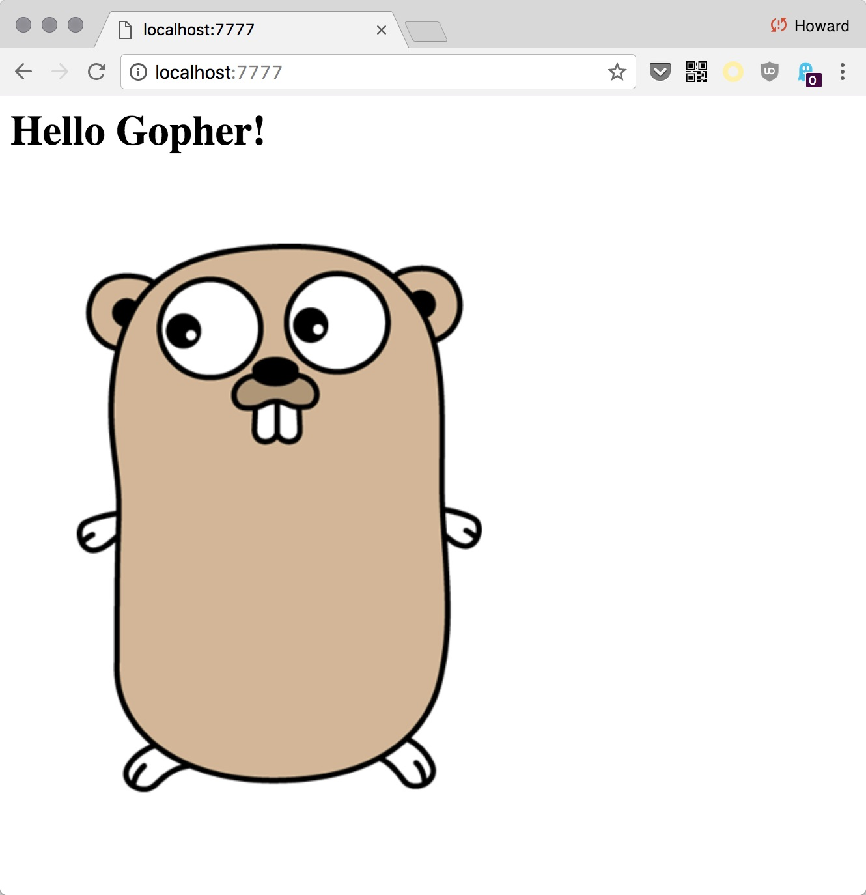

Implement a simple http sever that serves static content from a directory

## Instructions

It's simplse to build the file server using `http.FileServer`:

```
func main() {
	if len(os.Args) != 2 {
		fmt.Println("Usage: go run server.go [basedir]")
		os.Exit(1)
	}

	basedir := os.Args[1]
	fmt.Printf("serving content: %s\n", basedir)

	http.Handle("/", http.FileServer(http.Dir(basedir)))

	http.ListenAndServe(":7777", nil)
}
```

Please implement your own FileServer by completing the `serveContent` function:

```
func main() {
	if len(os.Args) != 2 {
		fmt.Println("Usage: go run server.go [basedir]")
		os.Exit(1)
	}

	basedir := os.Args[1]
	fmt.Printf("serving content: %s\n", basedir)

	// http.Handle("/", http.FileServer(http.Dir(basedir)))
	http.HandleFunc("/", serveContent)

	http.ListenAndServe(":7777", nil)
}

func serveContent(res http.ResponseWriter, req *http.Request) {
  // If error, write it as response
	//if err != nil {
	//	res.WriteHeader(http.StatusInternalServerError)
	//	res.Write([]byte(err.Error()))
	//	return
	//}

  // TODO: req.URL.Path is the file you want to output as response
  // Hint: Use io.Copy
}
```

+ [path.Join](https://golang.org/pkg/path/#Join)
  + Joins any number of path elements into a single path


## Example

```
$ go run server.go public
```

Open [http://localhost:7777](http://localhost:7777) You should see:


